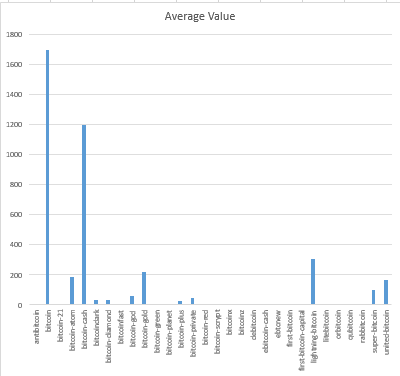
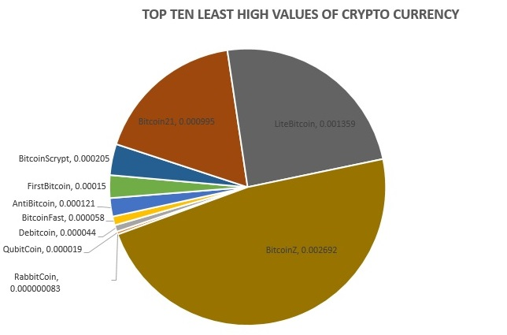
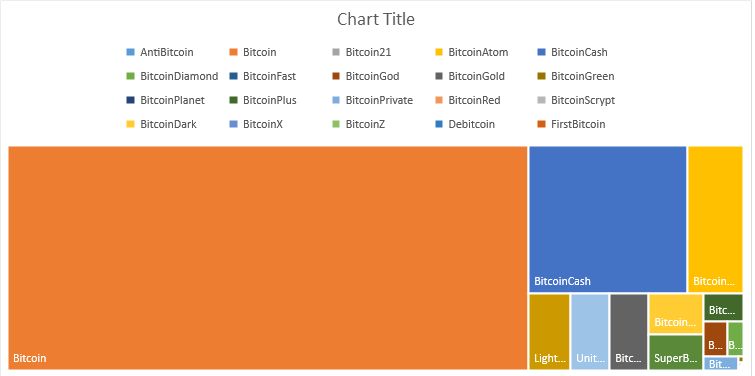
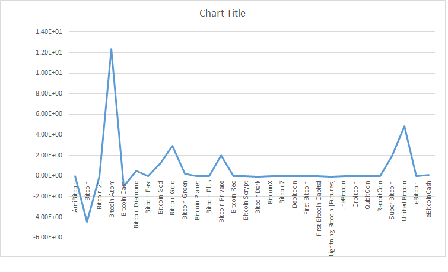

# Crypto-Markets

# Project Name: Crypto Markets (2013-2018)

## Links

* Repo Link: [https://bitbucket.org/S530742/crypto-markets.git](https://bitbucket.org/S530742/crypto-markets.git)

## Introduction:

This project objective is to find a data source and find solutions for few big data problems (one per each member of the team). We have choosen the data of Crypto currency price history from 2013 untill 2018. The first thing we did was we have cleaned the dataset found online by picking just the data needed. We next started working on writing Mapper file for the dataset and Reducer to find some aggregation later.

## Data Source:

* Data Link (Source): [https://www.kaggle.com/jessevent/all-crypto-currencies/data](https://www.kaggle.com/jessevent/all-crypto-currencies/data) 

* Type: Excel, 17mb, Bitcoins values from 2013 � 2018.

* Information contains details of open, close, high & low values for particular day.

* Format: Structured

### Big Data Qualifications / Challenges
	
1. Veracity: It gives us the statistical result for every cryptocurrency from 2013 to 2018 and it is trustworthy

2. Volume: Our data set has a huge data of around 60000 rows of data, which qualifies this to be huge 

3. Variety: Volume of data set for big data problem. We have a variety of cryptocurrencies which shows the variety part of big data. 

4. Value: These sets of cryptocurrency data can be used to analyze and hence improve investment decission by avoiding uncertain and imprecise data.

5. Velocity: Velocity for these crypto currency data sets will be constant as we are considering same days for all cryptocurrencies 

## Big Data Questions

	1. Which Crypto Currency has the highest high average of all the currencies?

	2. Which Crypto Currency has the least value of high in of all the currencies?
	
	3. Which Crypto Currency has the highest opening value of all?
	
	4. What is the difference bwn Avg of Open and close value?

## Big Data Solutions:

Solution 1:
 		Find the Average of each type of the bitcoin using reducer program then find the highest average value of the bitcoin.

Solution 2:
		Firstly, we retrieve the least high value of the each crypto currency, then get the least high value in 
		the list using reducer.

Solution 3:
		Firstly, we need to write a logic to get the highest opening value of all the days of the each type of the crypto currency then find the highest opening value bitcoin currency type.

Solution 4:
		We have to find the difference bwn Avg of Open and close value then find the difference between them.
		
## Specific Solutions:

**Solution Specific 1:**

   **Mapper input:**  
	
	slug	symbol	name	date	ranknow	open	high	low	close	volume
	
	bitcoin	BTC	Bitcoin	4/28/2013	1	135.3	135.98	132.1	134.21	0
   **Mapper output / Reducer input:**  
	
     Bitcoin	135.98
	 
   **Sort Output: **
   
     AntiBitcoin	0.000121
	
   **Reducer output:**  
	
	Name of Bitcoin: Bitcoin	 AVG high value: 1692.25754601	
	
   **Language:** Python 
	
   **Graph Type:** Bar Chart
   
   
   
**Solution Specific 2:**

   **Mapper input:**  
	
	slug	symbol	name	date	ranknow	open	high	low	close	volume
	
	bitcoin	BTC	Bitcoin	4/28/2013	1	135.3	135.98	132.1	134.21	0
   **Mapper output / Reducer input:**  
	
     Bitcoin	135.98
	 
   **Sort Output: **
   
     AntiBitcoin	0.000121
	
   **Reducer output:**  
	
	Name of Bitcoin: RabbitCoin      Least high value: 0.000000083
	
   **Language:** Python 
	
   **Graph Type:** Pie Chart
   
   
		
**Solution Specific 3:**
	
   **Mapper input:** 
	
	slug	symbol	name	date	ranknow	open	high	low	close	volume
	
	bitcoin	BTC	Bitcoin	4/28/2013	1	135.3	135.98	132.1	134.21	0
	
   **Mapper output / Reducer input:**  
	
	Key: Bitcoin; Value: 135.3
	
   **Reducer output: ** 
	
	Key: Bitcoin; Highest Open Value: 19177.8
	
   **Language:** Python
	
   **Graph**: Treemap.
   
   

Solution Specific 4:
	
   **Mapper input:**  
	
	slug	symbol	name	date	ranknow	open	high	low	close	volume
	
	bitcoin	BTC	Bitcoin	4/28/2013	1	135.3	135.98	132.1	134.21	0
	
   **Mapper output / Reducer input:**
	
	Key: Bitcoin; Value: 135.3
	
   **Reducer output:**  
	
	Key: Bitcoin; Highest Close Value: 17429.5 Date: 1/05/2018
	
   **Language:** Python 
	
   **Graph**: Line Graph 
	 
   
